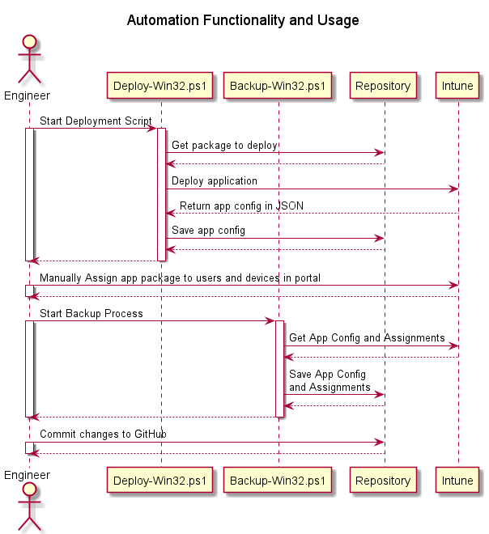
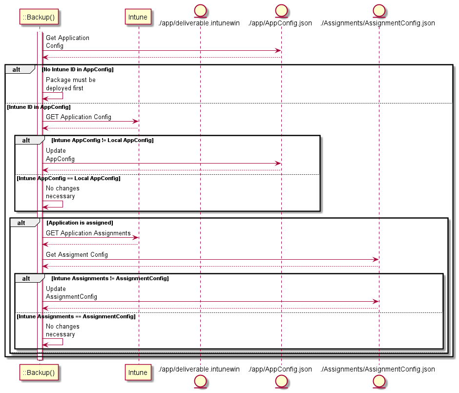

# Intune Win32 App Repository
This repository should hold all content for our deployed Win32 Apps that can be easily templated and deployed.  In order to deploy from this repository we need the following items for each package:
- The packaged binaries in an .intunewin file
- The application configuration in a .json file
- The application assignments in a .json file
- The group definitions in a .json file


### Pre-Requisites
#### Install the CISO Code Signing client
In order for content to be signed, a Code Signing Certificate must be installed.  For an example, you can see how to [Install a Code Signing Certificate with Digicert](https://www.digicert.com/kb/code-signing/installing-code-signing-certificate.htm).  

#### Install the required modules

Install the required Powershell Modules from an administrative command prompt.
```
Install-Module -Name IntuneWin32App
```

### Repository Structure
```
📦.
 ┣ 📂win32LobApp_NAME OF APPLICATION-1 
 ┃ ┣ 📜deliverable.intunewin
 ┃ ┣ 📜Config.ps1
 ┃ ┣ 📜win32LobApp_NAME OF APPLICATION 1.json
 ┃ ┗ 📂src
 ┣ 📂win32LobApp_NAME OF APPLICATION-2 (3, 4, etc...)
 ┣ 📂Assignments
 ┃ ┣ 📜win32LobApp_NAME OF APPLICATION 1.json
 ┃ ┗ 📜...
 ┣ 📂docs
 ┃ ┗ 📜UML Diagrams.puml
 ┣ 📂out             # Folder Structure Created by VS Code when exporting UML diagrams
 ┃ ┗ 📂docs
 ┃   ┗ 📜UML Diagrams.puml
 ┣ 📂deployment
 ┃  ┣ 📜Deploy-Win32Apps.ps1
 ┃  ┗ 📜Backup-Win32Apps.ps1
 ┣ 📜Build-Intunewin.ps1
 ┣ 📜Deploy-Intunewin.ps1
 ┣ 📜.gitignore
 ┗ 📜README.md 
```

### Process

#### Creating New Packages
When creating a new Win32App developers will use the following method:
1. Copy the TEMPLATE Folder as another folder in this directory with the name `win32LobApp_<NAME OF APPLICATION>`
2. Put the source files for the `.intunewin` file the `/src` directory in that folder (This includes any `.exe`, `.ps1`, `.vbs` or other necessary files)
3. Edit the `Config.ps1` File with the metadata needed for the build and the deployment
4. Use the `Build-IntuneWin.ps1` script to build the `.intunewin` deliverable.  Running it with no arguments will run the build on all folders in the repository.
    ```
    & .\Build-IntuneWin.ps1 -Win32Folder "win32LobApp_<NAME OF APPLICATION>"
    ```
5. Use the `Deploy-Win32.ps1` script to deploy the Win32 app based on the configurations in `Config.ps1`.  Running it with no arguments will run the deploy on all folders in the repository.
    ```
    & .\Deploy-Win32.ps1 -Win32Folder "win32LobApp_<NAME OF APPLICATION>"
    ```

#### DevOps Overview
Below is the overall DevOps process.  The content developer needs to develop both the content (the `.intunewin` file) and the configuration (the `.json` file).  We can develop tooling to make it easier to generate the configuration file as we have been using the GUI in the portal till now.  The developer will use a developer branch for each new application to prepare all content.  The developer can use the Dev Intune instance to perform dev testing.  When content is ready to be deployed to Intune, then the developer will issue a pull request to merge it to main.  After the branch is merged, that app can be deployed to the QA tenant for further QA and then to the Production Intune tenant.  

There are opportunities to further automate Unit testing and deployments using CI/CD tooling with this process.


#### Automation Functionality



#### Backup Script Process
*This script still needs to be written.  The Diagram below may change based on what is discovered during development.*

The Backup Script should be idempotent; if there are no changes to either the app config or the assignments there will be no changes to the backup repository.  This script can be executed both by Travis CI and an independent backup process (This allows us to track any modifications made in the portal).


### Under Development

We want to continue refining this process to increase idempotency.  The diagrams above document the end state; however, this repository is not yet there.  We are working on the following functionality
- ~~After deploying the app, saving the JSON config file back to the same directory~~
- Making `Deploy-Win32.ps1` idempotent so that if the Deploy is ran again and the app is deployed (using the JSON that was saved on the first deployment), then the app is either PATCHED or nothing happens.
- ~~Saving the app assignments to the `Assignments` Directory~~  This is done by calling the recently added function from `lib\Functions.ps1`: `InvokeIntuneBackupClientAppAssignment`
- Automating the regular backup of app configs and assignments to this directory